# Part 1. Инструмент ipcalc

## 1.1. Сети и маски
Вывод команды ipcalc:  
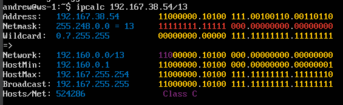
1) Адрес сети: 192.160.0.0/13
2) 255.255.255.0 = 11111111.11111111.11111111.00000000 = /24  
/15 = 255.254.0.0 = 11111111.11111110.00000000.00000000  
11111111.11111111.11111111.11110000 = 255.255.255.240 = /28  
3) - /8
        - min: 12.0.0.1
        - max: 12.255.255.254
   - 11111111.11111111.00000000.00000000
        - min: 12.167.0.1
        - max: 12.167.255.254
   - 255.255.254.0
        - min: 12.167.38.1
        - max: 12.167.39.254

## 1.2. localhost

К localhost можно обратиться по следующим адресам: 127.0.0.2, 127.1.0.1

## 1.3. Диапазоны и сегменты сетей

1) Определение публичных и частных IP
	- Публичные: 134.43.0.2, 172.0.2.1, 192.172.0.1, 172.68.0.2, 192.169.168.1
	- Частные: 10.0.0.45, 192.168.4.2, 172.20.250.4, 172.16.255.255, 10.10.10.10
2) Определение IP-адресов шлюза 10.10.0.0/18
	- 10.10.0.2, 10.10.10.10, 10.10.1.255

# Part 2. Статическая маршрутизация между двумя машинами
Вывод команды ip a:  
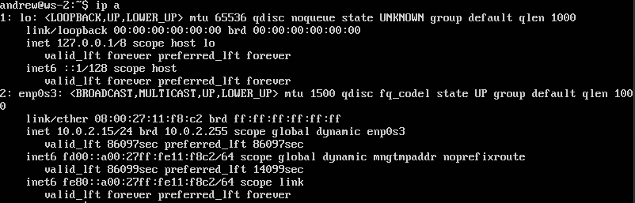

Содержимое файла etc/netplan/00-installer-config.yaml  
Для ws-1:  
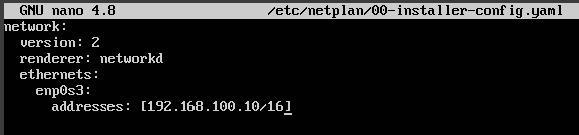  
Для ws-2:  
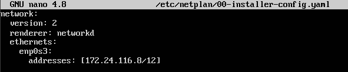 

Применение команды sudo netplan apply:  

## 2.1. Добавление статического маршрута вручную
Добавление статического маршрута  
На ws-1:  
  
На ws-2:  
  

Успешный пинг  
С ws-1 на ws-2:  
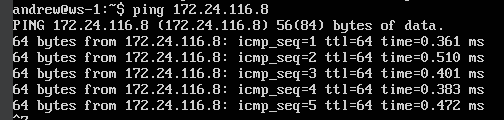  
С ws-2 на ws-1:  
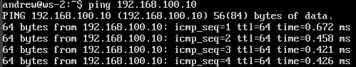  

## 2.2. Добавление статического маршрута с сохранением
Содержимое файла etc/netplan/00-installer-config.yaml  
Для ws-1:  
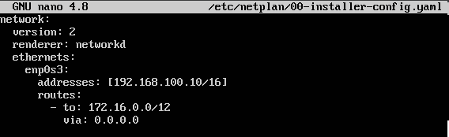  
Для ws-2:  
 

Успешный пинг  
С ws-1 на ws-2:  
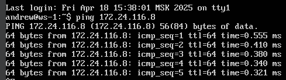  
С ws-2 на ws-1:  
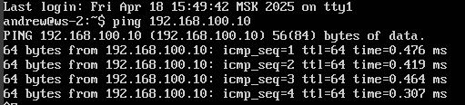 

# Part 3. Утилита iperf3

## 3.1. Скорость соединения

8 Mbps = 1 MB/s
100 MB/s = 800 Mbps = 800000 Kbps
1 Gbps = 1000 Mbps

## 3.2. Утилита iperf3 

Настройка и вывод результата на клиенте (ws-1):  
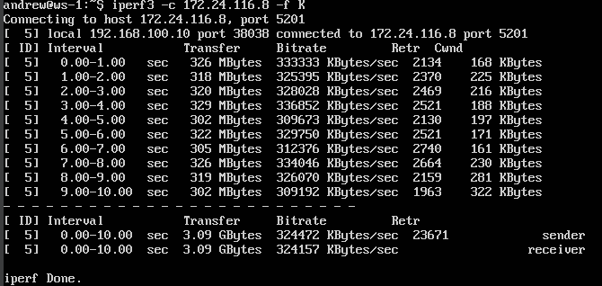 
Настройка и вывод результата на сервере (ws-2): 
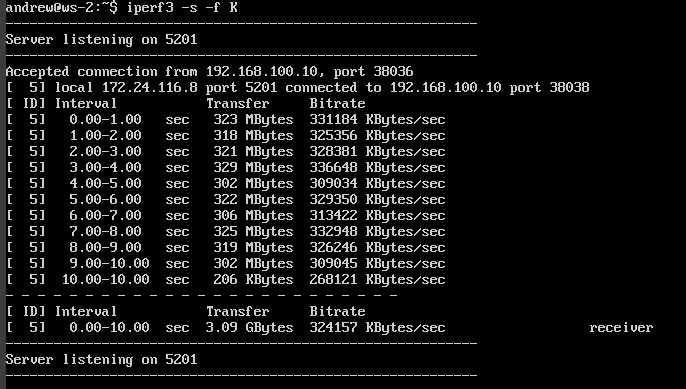 

# Part 4. Сетевой экран

## 4.1. Утилита iptables
Содержимое /etc/firewall.sh  
Для ws-1:  
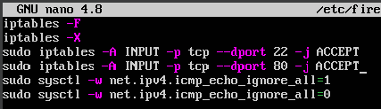  
Для ws-2:  
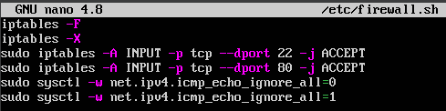 

 Запуск firewall.sh  
 ws-1:  
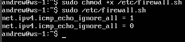  
 ws-2:  
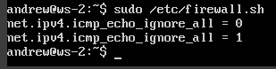  
Разница от порядка команд на разрешение и запрет echo reply заключается в том, что применено будет то правило, которое шло последним (то есть на ws-1 пинг будет разрешен, а на ws-2 запрещен)
## 4.2. Утилита nmap
Пинг (неудачный) и вывод nmap  
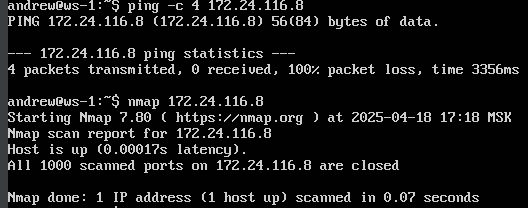  
# Part 5. Статическая маршрутизация сети

## 5.1. Настройка адресов машин
Содержимое файла etc/netplan/00-installer-config.yaml  
Для ws-11:  
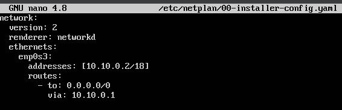  
Для ws-21:  
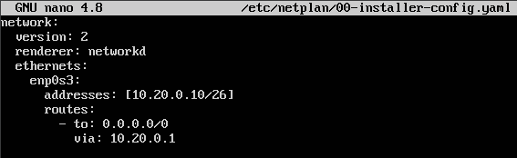  
Для ws-22:  
  
Для r1:  
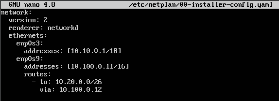  
Для r2:  
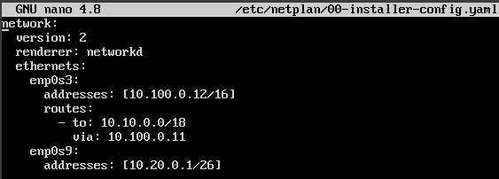

## 5.2. Включение переадресации IP-адресов

Включение переадресации (до перезагрузки):  
  

Включение постоянной переадресации:  
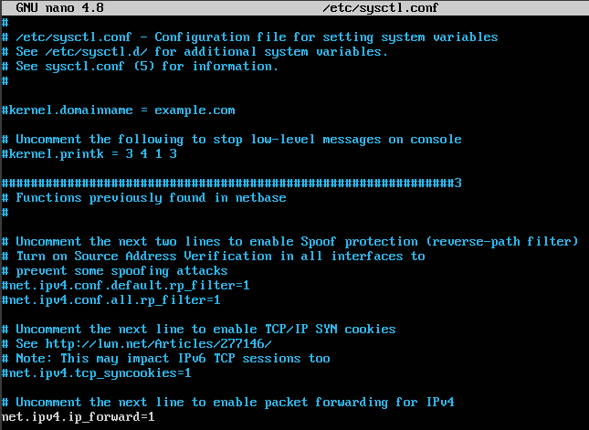

## 5.3. Установка маршрута по умолчанию
Маршрут по умолчанию установлен:  
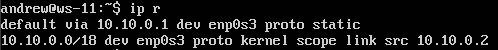  

Пакет дошел до роутера 2:  
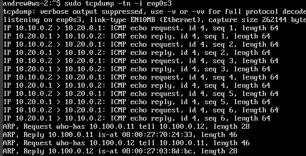 

## 5.4. Добавление статических маршрутов
Содержимое файла etc/netplan/00-installer-config.yaml  
Для r1:  
  
Для r2:  

Таблица маршрутизации  
Для r1:  
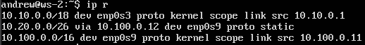  
Для r2:  
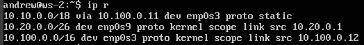 

Вывод команд ip r list:
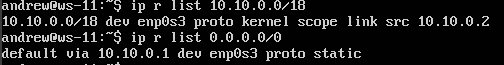  
Для адреса 10.10.0.0/18 был выбран маршрут, отличный от 0.0.0.0/0, потому что 10.10.0.0/18 это сеть, в которой находится ws-11.
## 5.5. Построение списка маршрутизаторов
Вывод команды traceroute:
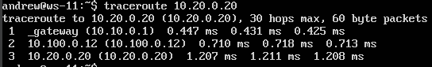  
Вывод команды tcpdump:
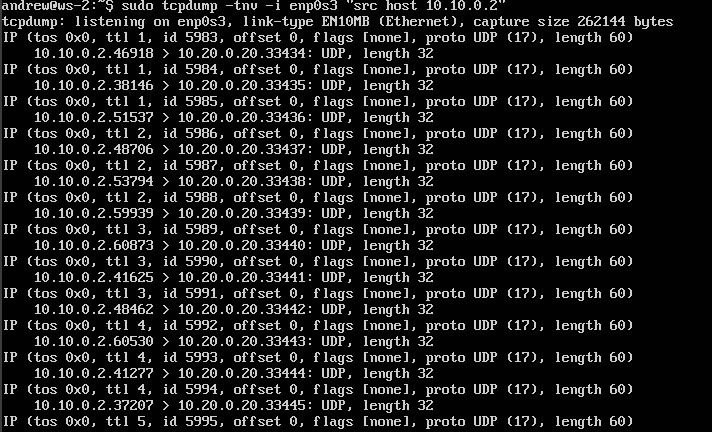  
Как можно увидеть по выводу tcpdump, traceroute отправляет пакеты с нарастающим ttl (time to live), таким образом, пакет сначала доходит до роутера р1 и возвращается, затем до р2 и возвращается, затем до ws-22.
## 5.6. Использование протокола ICMP при маршрутизации
Вывод команды ping:  
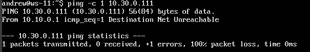  
Вывод команды tcpdump:
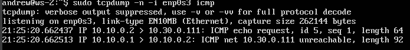  
# Part 6. Динамическая настройка IP с помощью DHCP
Содержимое dhcpd.conf:  
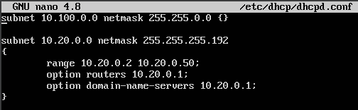  
содержимое resolv.conf:  
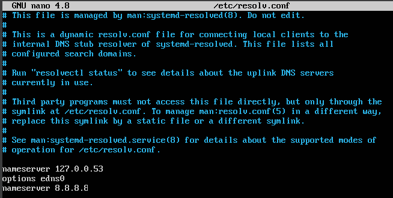 

Появился новый адрес + успешный пинг ws-22  
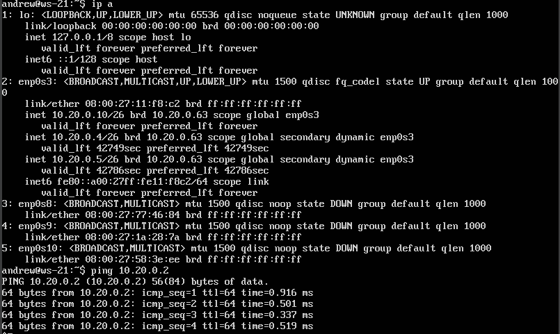 

Добавил мак-адрес для ws-11:  
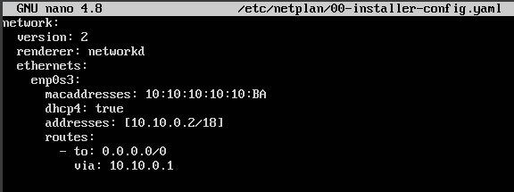 

Жесткая привязка к мак адресу: 
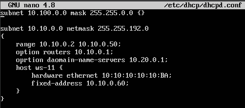 

# Part 7. NAT

# Part 8. Дополнительно. Знакомство с SSH Tunnels